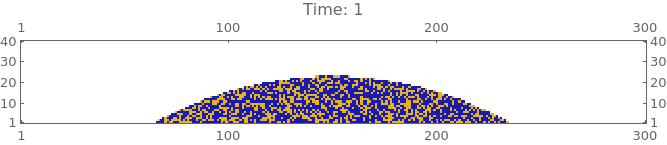

# Oil extraction from oil-in-water emulsions

This program performs a Monte Carlo simulation to model the extraction of oil from
oil-in-water emulsion droplets under the effect of a surface acoustic wave.  
The simulation conditions can be modified in the file `condiciones.dat`.

This program is used in the article:

Monte Carlo–based model for the extraction of oil from oil-water mixtures using wetting and surface acoustic waves
J. M. Marcos et al., *Phys. Rev. E* 112, 025502 (2025) 
 
DOI: https://doi.org/10.1103/cckb-5m6h  
arXiv: https://arxiv.org/abs/2504.05777

## 🛠️ Technologies
- C

## 📦 Compilation
make

To clean generated files:  
make clean

## ▶️ Execution
./ejecutableOil condiciones.dat
